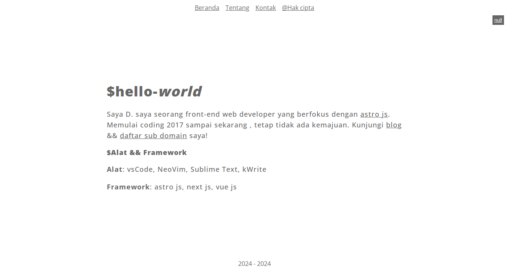
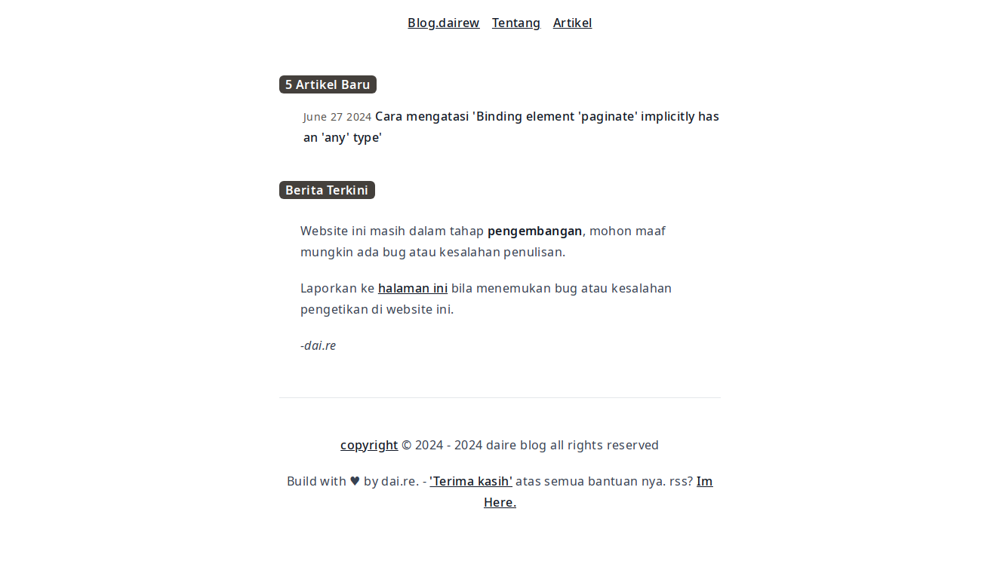
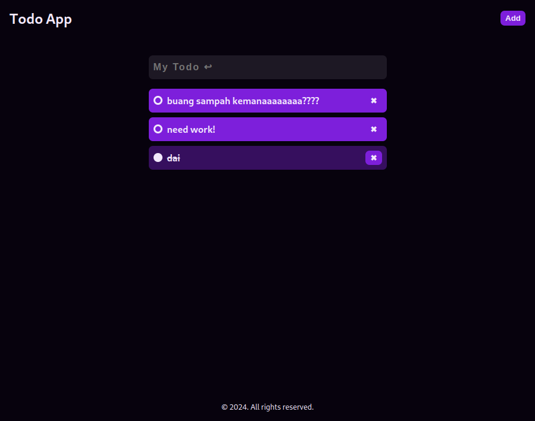

# 100 Day Website Project

- [ ] **Landing Page**: Buat landing page untuk startup fiktif.
- [x] **Personal Portfolio**: Buat situs portofolio pribadi. [Here](#portofolio)
- [x] **Blog**: Buat blog sederhana dengan halaman posting. [Here](#blog)
- [x] **To-Do List**: Buat aplikasi to-do list.\*\*\*\* [Here](#todo-list)
- [ ] **Weather App**: Buat aplikasi cuaca menggunakan API cuaca.
- [ ] **E-commerce Product Page**: Buat halaman produk e-commerce.
- [ ] **Calculator**: Buat aplikasi kalkulator.
- [ ] **Quiz App**: Buat aplikasi kuis interaktif.
- [ ] **Recipe App**: Buat aplikasi resep masakan.
- [ ] **Movie Search**: Buat aplikasi pencarian film menggunakan API film.
- [ ] **Gallery**: Buat galeri foto.
- [ ] **Chat App**: Buat aplikasi chat sederhana.
- [ ] **Fitness Tracker**: Buat aplikasi pelacak kebugaran.
- [ ] **Expense Tracker**: Buat aplikasi pelacak pengeluaran.
- [ ] **Travel Journal**: Buat jurnal perjalanan.
- [ ] **Event Countdown**: Buat aplikasi hitung mundur acara.
- [ ] **Language Translator**: Buat aplikasi penerjemah bahasa.
- [ ] **Music Player**: Buat pemutar musik sederhana.
- [ ] **Markdown Editor**: Buat editor markdown.
- [ ] **Flashcards**: Buat aplikasi flashcards untuk belajar.
- [ ] **Stock Tracker**: Buat aplikasi pelacak saham.
- [ ] **Recipe Finder**: Buat aplikasi pencari resep dengan bahan tertentu.
- [ ] **Book Library**: Buat perpustakaan buku digital.
- [ ] **CV Builder**: Buat aplikasi pembuat CV.
- [ ] **Real-time Polling**: Buat aplikasi polling waktu nyata.
- [ ] **Trivia Game**: Buat game trivia.
- [ ] **Typing Test**: Buat aplikasi tes kecepatan mengetik.
- [ ] **Task Manager**: Buat manajer tugas.
- [ ] **Chatbot**: Buat chatbot sederhana.
- [ ] **User Authentication**: Buat sistem otentikasi pengguna.
- [ ] **File Uploader**: Buat aplikasi pengunggah file.
- [ ] **Interactive Map**: Buat peta interaktif menggunakan API peta.
- [ ] **Recipe App with Ratings**: Buat aplikasi resep dengan sistem penilaian.
- [ ] **Random Quote Generator**: Buat generator kutipan acak.
- [ ] **Currency Converter**: Buat aplikasi konversi mata uang.
- [ ] **Time Tracker**: Buat aplikasi pelacak waktu kerja.
- [ ] **Survey Form**: Buat form survei.
- [ ] **Social Media Dashboard**: Buat dasbor media sosial.
- [ ] **Notes App**: Buat aplikasi catatan.
- [ ] **Weather Dashboard**: Buat dasbor cuaca.
- [ ] **Job Board**: Buat papan pekerjaan.
- [ ] **Recipe Collection**: Buat koleksi resep dengan kategori.
- [ ] **GitHub Profile Finder**: Buat aplikasi pencari profil GitHub.
- [ ] **Personal Diary**: Buat buku harian pribadi.
- [ ] **E-commerce Shopping Cart**: Buat keranjang belanja e-commerce.
- [ ] **Online Store**: Buat toko online sederhana.
- [ ] **Image Slider**: Buat slider gambar.
- [ ] **Digital Clock**: Buat jam digital.
- [ ] **Portfolio Gallery**: Buat galeri portofolio.
- [ ] **Restaurant Menu**: Buat menu restoran digital.
- [ ] **Fitness App with Goals**: Buat aplikasi kebugaran dengan tujuan.
- [ ] **Recipe App with Shopping List**: Buat aplikasi resep dengan daftar belanja.
- [ ] **Product Review App**: Buat aplikasi ulasan produk.
- [ ] **Event Scheduler**: Buat penjadwal acara.
- [ ] **Simple Blog with Comments**: Buat blog dengan fitur komentar.
- [ ] **Newsletter Subscription**: Buat form langganan newsletter.
- [ ] **Forum**: Buat forum diskusi sederhana.
- [ ] **Pomodoro Timer**: Buat aplikasi timer Pomodoro.
- [ ] **News Aggregator**: Buat agregator berita.
- [ ] **Image Editor**: Buat editor gambar sederhana.
- [ ] **Online Quiz Platform**: Buat platform kuis online.
- [ ] **Interactive Story**: Buat cerita interaktif.
- [ ] **Travel Itinerary Planner**: Buat perencana perjalanan.
- [ ] **Audio Recorder**: Buat aplikasi perekam audio.
- [ ] **Local Events Finder**: Buat pencari acara lokal.
- [ ] **Habit Tracker**: Buat aplikasi pelacak kebiasaan.
- [ ] **Virtual Business Card**: Buat kartu nama virtual.
- [ ] **Donation Platform**: Buat platform donasi.
- [ ] **Health Tips App**: Buat aplikasi tips kesehatan.
- [ ] **Budget Planner**: Buat perencana anggaran.
- [ ] **Pet Adoption**: Buat aplikasi adopsi hewan peliharaan.
- [ ] **Library Management**: Buat sistem manajemen perpustakaan.
- [ ] **Photo Collage Maker**: Buat pembuat kolase foto.
- [ ] **Online Drawing**: Buat aplikasi menggambar online.
- [ ] **Fashion Lookbook**: Buat buku lookbook fashion.
- [ ] **Travel Guide**: Buat panduan perjalanan.
- [ ] **Music Recommendation**: Buat aplikasi rekomendasi musik.
- [ ] **Recipe Box**: Buat kotak resep digital.
- [ ] **Time Zone Converter**: Buat aplikasi konversi zona waktu.
- [ ] **Car Rental**: Buat aplikasi penyewaan mobil.
- [ ] **Online Voting System**: Buat sistem pemungutan suara online.
- [ ] **Portfolio Blog**: Buat blog portofolio.
- [ ] **Interactive Timeline**: Buat timeline interaktif.
- [ ] **Personal Finance Tracker**: Buat pelacak keuangan pribadi.
- [ ] **Code Snippet Manager**: Buat manajer kode snippet.
- [ ] **Study Planner**: Buat perencana belajar.
- [ ] **Event Ticketing**: Buat aplikasi penjualan tiket acara.
- [ ] **Customizable Dashboard**: Buat dasbor yang dapat dikustomisasi.
- [ ] **Social Media Profile Page**: Buat halaman profil media sosial.
- [ ] **E-commerce Admin Dashboard**: Buat dasbor admin e-commerce.
- [ ] **Podcast Player**: Buat pemutar podcast.
- [ ] **FAQ Page**: Buat halaman FAQ.
- [ ] **Yoga Pose Guide**: Buat panduan pose yoga.
- [ ] **Personal Blog**: Buat blog pribadi.
- [ ] **Budget Tracker with Graphs**: Buat pelacak anggaran dengan grafik.
- [ ] **Meal Planner**: Buat perencana makanan.
- [ ] **Virtual Whiteboard**: Buat papan tulis virtual.
- [ ] **Pet Care Guide**: Buat panduan perawatan hewan peliharaan.
- [ ] **Mental Health App**: Buat aplikasi kesehatan mental.
- [ ] **Gardening Planner**: Buat perencana berkebun.

## Portofolio:

[www.dairew.my.id](https://www.dairew.my.id)

[v2.dairew.my.id](https://v2.dairew.my.id)

## Blog:

[blog.dairew.my.id](https://blog.dairew.my.id)

## To-Do List:

[dai-re/todo-app-pure](https://github.com/dai-re/todo-app-pure)

